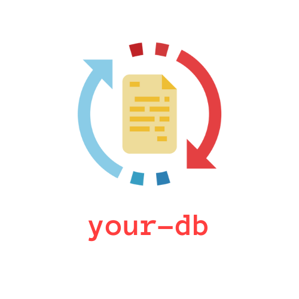

Your-db is an in memory database which supports basic CRUD operations.

### Installation and Usage

You can install your-db via npm

```
npm install your-db

yarn add your-db
```

You can initialize your db with

```
import generateDB from 'your-db'

interface dataSchema {
  name: string;
  email: string;
  age: number;
}

// TypeScript can also infer your dataSchema type! :D

const myDB = generateDB<dataSchema>(data);
```

There are 5 main methods you can use with your database.

```
// Get all your data in your db
myDB.getAll()

// Get a particular item with id
myDB.getById(id)

// Remove an entry with id
myDB.remove(id)

// Update an entry with id and new data for that
myDB.remove(id, newData)

// Adding new data
myDB.add(data)
```

### Purpose and reasons

An in-memory database is a type of database that relies primarily on memory for data storage, in contrast to databases that store data on disk or SSDs. Because all data is stored and managed exclusively in main memory, it is at risk of being lost upon a process or server failure. In-memory databases can persist data on disks by storing each operation in a log or by taking snapshots. This project illustrates what an in memory database looks like for CRUD operations

### Contributions

Contributions of any kind is welcomed :)
